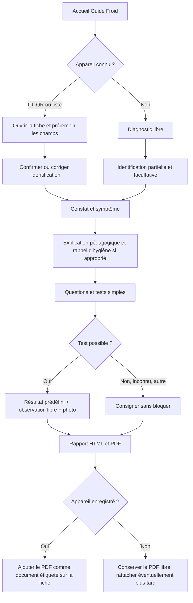
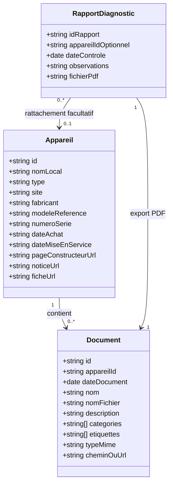
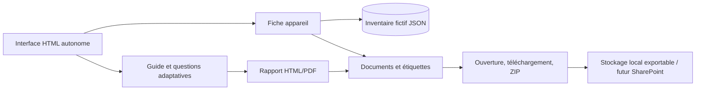

# Guide Froid — Documentation du MVP

**Statut :** démonstrateur autonome, appareils fictifs. **Principe directeur :** le guide pédagogique de diagnostic et le rapport d'incident restent le cœur de l'application. La fiche appareil est un complément documentaire léger, sans fonctions d'ERP, de comptabilité ou de logiciel SAV.

## 1. Parcours utilisateur — diagramme d'activités

## 2. Modèle de données UML minimal

**Pas de tables Incident, Intervention ou Maintenance distinctes à maintenir :** ce sont des *catégories de documents* et non des modules métier autonomes. L'historique résulte du tri par date de la bibliothèque documentaire.

## 3. Composants — séparation du code et des données

Les dépendances nécessaires au MVP doivent pouvoir voyager avec son dossier. Le futur adaptateur SharePoint remplace uniquement le stockage ; les questionnaires et les fiches ne doivent pas dépendre de SharePoint pour s'afficher.

## 4. Fiche appareil : seulement l'essentiel

- ID fictif stable (`DEMO-FROID-001`), nom local libre.
- Type, fabricant, modèle ou référence, numéro de série, site actuel et emplacement.
- Dates d'achat et de mise en service **si connues**, sans obligation.
- Photographie générale et plaque signalétique (documents catégorisés).
- **Liens web facultatifs** : site ou page constructeur, fiche produit, notice d'utilisation, documentation complémentaire. Valider les liens HTTP(S) avant affichage ; jamais d'URL construite arbitrairement.
- QR code : URL canonique `index.html?appareil=DEMO-FROID-001` une fois hébergé ; le QR n'est utile que si cette URL et l'inventaire sont disponibles. Pas de fausse URL ou de QR censé fonctionner hors hébergement.

## 5. Documents de l'appareil : bibliothèque sans ERP

Chaque document a **date, nom, nom de fichier, description facultative, catégorie(s), étiquette(s), fichier ou URL**, et l'ID de l'appareil. Catégories proposées : `notice`, `photo`, `plaque`, `diagnostic`, `incident`, `intervention`, `temperature`, `facture`, `garantie`, `autre`. Une même pièce peut porter plusieurs catégories et étiquettes libres.

La page présente cartes, vignettes, liste et tableau ; recherche et filtres par catégorie, étiquette, date ou nom. Visualiser si le navigateur le permet, sinon télécharger ; exporter une pièce ou les pièces sélectionnées en ZIP.

**Exemple** : le diagnostic du 10/10/2026 est un PDF ajouté avec `categories: ["diagnostic", "incident"]`, sans création de dossier SAV ou de registre d'incident séparé.

## 6. Comportement du diagnostic

L'utilisateur peut débuter sans appareil, saisir uniquement ce qu'il sait, ou ouvrir une fiche par ID/QR et confirmer ses données préremplies. Les réponses `Je ne sais pas`, `Je ne peux pas vérifier`, `Autre / à préciser` et `Non concerné` ne bloquent jamais. Chaque vérification comprend : objectif, matériel, méthode sans démontage, résultat prédéfini, observation libre, fichiers associés.

En cas de température anormale, le guide rappelle de se référer au guide et aux procédures d'hygiène applicables pour la conduite à tenir sur les produits ; il ne reproduit ni seuils ni décisions de conformité.

Rapport : HTML lisible, export PDF avec images si possibles. Fusion directe de PDF annexes = amélioration encore à finaliser ; tant qu'elle n'est pas effective, ne pas prétendre qu'un PDF global contient tous les originaux.

## 7. Périmètre et séquençage

**MVP actuel :** rapport de diagnostic pédagogique, tests, pièces jointes, export. **Prochain incrément :** inventaire fictif, fiche appareil et bibliothèque documentaire catégorisée, préremplissage et QR après hébergement. **Plus tard :** stockage documentaire SharePoint, inventaire réel progressif, suivi qualité/traçabilité si décidé.

Les inventaires fictifs et sauvegardes doivent rester exportables/importables. Un site HTML statique ne peut pas modifier à lui seul le dossier SharePoint partagé de tous les utilisateurs.

## 8. Critères de validation

1. Diagnostic sans enregistrement d'appareil.
2. Diagnostic à partir d'un ID existant sans ressaisie.
3. Aucun blocage lorsqu'un champ ou une pièce manque.
4. Export PDF conservant les résultats et observations des tests.
5. Ajout d'un PDF d'incident dans la bibliothèque documentaire de l'appareil.
6. Filtres multi-étiquettes et téléchargement individuel/ZIP.
7. Ouverture d'une notice externe sans perdre le travail en cours.
8. Déplacement du dossier complet sans dépendance au Studio Hub.

**L'architecture décrite est la cible documentée ; elle ne signifie pas que chaque fonctionnalité est déjà codée et validée.**